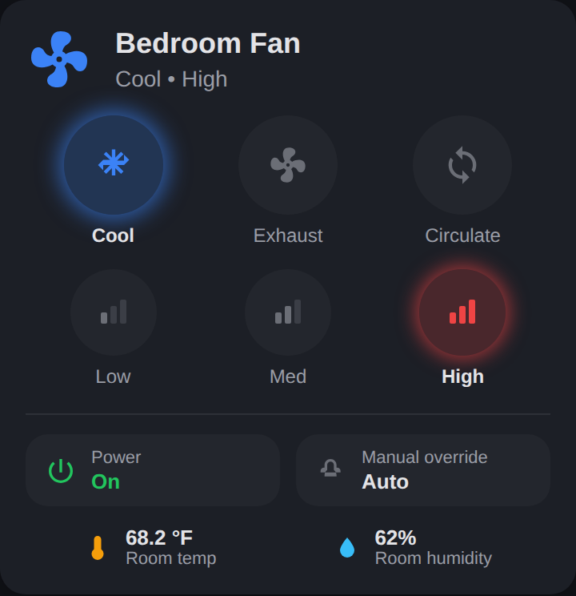

# Window Fan Card + Automation

Home Assistant control for IR-remote window fans that report no state of
their own — the kind with a mode button (cool → exhaust → circulate) and a
speed button (low → med → high) that only cycle forward, with no way to ask
the fan where it is.

The trick: every mode/speed combination draws a distinct, repeatable amount
of power, so a smart plug's energy monitoring tells us exactly what the fan
is doing. From there we can work out precisely how many times to press each
button to get anywhere we want.



## What's here

| | |
|---|---|
| `dist/window-fan-card.js` | The Lovelace card. Install via HACS, configure with dropdowns — no YAML. |
| `packages/window_fan_bedroom.yaml` | One file that creates every helper, sensor, script and automation. |
| `docs/setup.html` | Setup page — enter your entities and wattages, get the config generated for you. |

**Start here:** open `docs/setup.html` in a browser. Put in your entity IDs
and the wattages you measured, and it generates the package file and card
config, checks your readings are far enough apart to tell apart, and gives
you a checklist of what's left to do.

The card works entirely on its own — it decodes the plug wattage and sends
the IR commands itself. The package is only needed if you also want the
automated humidity/temperature management.

---

## Part 1 — The card

### Install

1. HACS → three-dot menu → **Custom repositories**
2. Repository: `https://github.com/Tmatz27/HA-autos-for-me`, type: **Dashboard**
3. Find **Window Fan Card** in HACS → Download
4. Hard-refresh your browser (Ctrl+Shift+R)

### Add it

Dashboard → Edit → **Add Card** → search "Window Fan". The visual editor
gives you a dropdown for every field:

| Field | What it is |
|---|---|
| Smart plug power sensor | The plug's power reading in watts. **Required.** |
| Smart plug switch | The plug's on/off switch, used for power control. |
| IR remote entity | Your Broadlink (or similar) remote. **Required.** |
| IR device name | The device name you used when learning the codes, e.g. `Master Fan`. **Required.** |
| Mode / speed toggle command | The learned command names. Default `mode_toggle` / `speed_toggle`. |
| Seconds between presses | Time for the fan to register each press. Default 2. |
| Room temperature / humidity | Optional, shown at the bottom of the card. |
| Manual override helper | Optional; created by the package below. |
| Measured wattages | Your fan's six readings — see calibration below. |

### Calibrate your fan

This is the one step that's specific to your hardware. Watch the plug's
power sensor and step the fan through each combination, noting the watts:

| | Low | Med | High |
|---|---|---|---|
| **Cool** | | | |
| **Exhaust** | | | |

Put those six numbers in the card's **Measured wattages** section. You don't
need to measure circulate — it runs one fan each way, so the card derives it
as the average of cool and exhaust at the same speed.

(For reference, the fan this was built for reads: exhaust 31/33/36 W, cool
45/48/51 W.)

### How it drives the fan

Both loops only move forward, so the card counts steps around them:

- **Mode:** cool → exhaust → circulate → cool. Cool to exhaust is 1 press;
  exhaust back to cool is 2 (it steps through circulate).
- **Speed:** low → med → high → low.

If the fan is off, the card switches the plug on first — the fan always
boots to cool/low — then presses on from there. Buttons are disabled while a
sequence is in flight so a double-tap can't desync the count.

---

## Part 2 — The automation package

Only needed if you want hands-off humidity/temperature management.

### Install

1. Make sure `configuration.yaml` has:

   ```yaml
   homeassistant:
     packages: !include_dir_named packages
   ```

2. Copy `packages/window_fan_bedroom.yaml` into `config/packages/`
3. Open it and find-and-replace the eight entity IDs listed at the top of
   the file (they're all called out in a block — nothing is hidden further
   down)
4. Restart Home Assistant

That's the whole setup. There are **no helpers to create by hand** — the
package makes all of them.

### What it creates

| Entity | Purpose |
|---|---|
| `sensor.bedroom_fan_state` | Decoded state: `cool_high`, `exhaust_low`, `circulate_med`, `off`, … |
| `input_boolean.bedroom_fan_night_phase` | On between bedtime and the morning reset |
| `input_boolean.bedroom_fan_manual_override` | Pauses the cycle automations |
| `input_datetime.bedroom_fan_last_command_time` | Debounce timestamp |
| `script.bedroom_fan_set_state` | Sets any mode + speed |
| 4 automations | Bedtime, night cycle, morning reset, day cycle |

Point the card's **Manual override helper** field at
`input_boolean.bedroom_fan_manual_override` and the card's override pill
will pause the automations, so a manual choice sticks instead of being
reverted 30 minutes later.

### What the automations do

1. **Bedtime kickoff** — when the TV goes `unavailable` after 8pm, clear the
   override, set cool/high, and enter the night phase.
2. **Night cycle** — switch to exhaust to dehumidify, but only while the room
   is genuinely cool (≤62 °F) and humid (≥75 %). The moment it warms to
   65 °F, or dries to 60 %, go back to cool — sleeping comfort outranks
   humidity.
3. **Morning reset** — end the night phase when outdoor humidity drops below
   75 %, or at 10am, whichever comes first. Outdoor humidity here often
   doesn't break until late morning, so 10am is the backstop.
4. **Day cycle** — humidity first (exhaust at ≥68 %, cool at ≤60 %), but never
   let the room pass 75 °F, so we're not fighting a hot room at bedtime.

Speed stays on high throughout. Every switch is held to a **30-minute
minimum gap** — the fan beeps on each press, and this is a bedroom.

### Tuning

All the thresholds are plain numbers in the automations — `62`, `65`, `75`,
`60`, `68`, `1800` (the debounce, in seconds). Edit them directly.

---

## Notes

- Power on/off uses the plug's switch rather than the remote's power button.
  The IR power button is a blind toggle; the switch is deterministic.
- The card needs no helpers, template sensors, or scripts. Those exist only
  for the automations, which run server-side and can't use the card's logic.
- If the fan gets out of sync (someone used the physical remote), it
  self-corrects on the next command — state is always re-read from the plug,
  never remembered.
