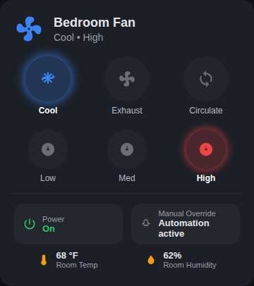

# HA Autos For Me

Personal Home Assistant automations.

## Bedroom Fan

Manages a remote-controlled dual-function window fan (cool/exhaust/circulate,
low/med/high) that gives no native state feedback, by decoding its real
state from smart-plug wattage and driving it through a Broadlink remote.

### Control card



A mockup of `bedroom_fan/card.yaml` (Cool/High shown active). The fan icon
and status line up top reflect the live state; each light in the two rows
below is also a button - tap Cool/Exhaust/Circulate to change mode, tap
Low/Med/High to change speed, and the bottom row has a power toggle and a
manual-override toggle that pauses the automations below.

### Files

- `bedroom_fan/template_sensor.yaml` - decodes function+speed from plug
  wattage into `sensor.bedroom_fan_state` (states like `cool_high`,
  `exhaust_low`, `circulate`, `off`).
- `bedroom_fan/helpers.yaml` - `input_boolean.bedroom_fan_night_phase`,
  `input_boolean.bedroom_fan_manual_override`, and
  `input_datetime.bedroom_fan_last_command_time`.
- `bedroom_fan/script.yaml` - `script.bedroom_fan_set_state`, the only place
  that talks to the remote/plug. Call it with `target_function`
  (cool/exhaust/circulate) and `target_speed` (low/med/high); it figures out
  exactly how many times to press the remote's toggle buttons from wherever
  the fan currently is.
- `bedroom_fan/card.yaml` - Lovelace card: fan icon + status text, glowing
  "light" buttons for mode and speed, a power toggle, a manual-override
  toggle, and small temp/humidity readouts. Requires `custom:button-card`
  and `custom:stack-in-card` from HACS.
- `automations/bedroom_fan_bedtime_kickoff.yaml`
- `automations/bedroom_fan_night_cycle.yaml`
- `automations/bedroom_fan_morning_reset.yaml`
- `automations/bedroom_fan_day_cycle.yaml`

### How the logic flows

1. **Bedtime kickoff** - triggers when the bedroom TV goes `unavailable`
   after 8pm. Clears manual override, sets the fan to cool/high, and flips
   on the night phase.
2. **Night cycle** - while temp is <=62F and humidity is >=75%, switches to
   exhaust to dehumidify. Once temp climbs to >=65F (comfort while asleep
   wins) or humidity drops to <=60%, switches back to cool. Speed always
   stays high. 30 minute minimum gap between switches to limit beeping.
3. **Morning reset** - ends the night phase once outdoor humidity
   (`sensor.aso_vandenberg_humidity`) drops below 75%, or by 10am at the
   latest. Resets to cool/high, hands off to the day cycle.
4. **Day cycle** - switches to exhaust once humidity is >=68%, back to cool
   once humidity is <=60% or temp is >=75F. Same 30 minute debounce.

Both cycle automations stand down while `input_boolean.bedroom_fan_manual_override`
is on, so a manual button press on the card doesn't get silently reverted.
The override auto-clears every night at bedtime kickoff.

### The automations

Plain YAML, meant to be pasted in and edited directly - no blueprint layer.

**`automations/bedroom_fan_bedtime_kickoff.yaml`**
```yaml
alias: Bedroom Fan - Bedtime Kickoff
description: >-
  Once the bedroom TV goes unavailable after 8pm, clear any manual override,
  turn the bedroom fan to cool/high, and enter the night humidity-management
  phase.
triggers:
  - trigger: state
    entity_id: media_player.lg_webos_tv_oled65c2pua
    to: "unavailable"
    for:
      seconds: 10
conditions:
  - condition: time
    after: "20:00:00"
    before: "23:59:59"
actions:
  - action: input_boolean.turn_on
    target:
      entity_id: input_boolean.bedroom_fan_night_phase
  - action: input_boolean.turn_off
    target:
      entity_id: input_boolean.bedroom_fan_manual_override
  - action: script.bedroom_fan_set_state
    data:
      target_function: cool
      target_speed: high
mode: restart
```

**`automations/bedroom_fan_night_cycle.yaml`**
```yaml
alias: Bedroom Fan - Night Humidity Cycle
description: >-
  While in the night phase and not manually overridden, switch to exhaust
  once the room is cool and humid enough to dehumidify, then back to cool
  once the room warms up or dries out enough (comfort while sleeping takes
  priority over humidity). Speed always stays on high. 30 minute minimum gap
  between switches to limit beeping.
triggers:
  - trigger: state
    entity_id: sensor.master_air_quality_temperature
  - trigger: state
    entity_id: sensor.master_air_quality_humidity
conditions:
  - condition: state
    entity_id: input_boolean.bedroom_fan_night_phase
    state: "on"
  - condition: state
    entity_id: input_boolean.bedroom_fan_manual_override
    state: "off"
  - condition: template
    value_template: >-
      {{ states('input_datetime.bedroom_fan_last_command_time') in ['unknown', 'unavailable']
         or (now() - (states('input_datetime.bedroom_fan_last_command_time') | as_datetime)).total_seconds() >= 1800 }}
actions:
  - variables:
      temp: "{{ states('sensor.master_air_quality_temperature') | float(99) }}"
      humidity: "{{ states('sensor.master_air_quality_humidity') | float(0) }}"
      fan_state: "{{ states('sensor.bedroom_fan_state') }}"
  - choose:
      - conditions:
          - condition: template
            value_template: "{{ 'cool' in fan_state and temp <= 62 and humidity >= 75 }}"
        sequence:
          - action: script.bedroom_fan_set_state
            data:
              target_function: exhaust
              target_speed: high
      - conditions:
          - condition: template
            value_template: "{{ 'exhaust' in fan_state and (temp >= 65 or humidity <= 60) }}"
        sequence:
          - action: script.bedroom_fan_set_state
            data:
              target_function: cool
              target_speed: high
mode: single
```

**`automations/bedroom_fan_morning_reset.yaml`**
```yaml
alias: Bedroom Fan - Morning Reset
description: >-
  Ends the night phase once outdoor humidity drops below 75%, or by 10am at
  the latest, resets the fan to cool/high, and hands control to the daytime
  cycle.
triggers:
  - trigger: numeric_state
    entity_id: sensor.aso_vandenberg_humidity
    below: 75
  - trigger: time
    at: "10:00:00"
conditions:
  - condition: state
    entity_id: input_boolean.bedroom_fan_night_phase
    state: "on"
actions:
  - action: script.bedroom_fan_set_state
    data:
      target_function: cool
      target_speed: high
  - action: input_boolean.turn_off
    target:
      entity_id: input_boolean.bedroom_fan_night_phase
mode: single
```

**`automations/bedroom_fan_day_cycle.yaml`**
```yaml
alias: Bedroom Fan - Daytime Humidity Cycle
description: >-
  During the day, prioritize keeping humidity down but never let room temp
  climb above 75F. Speed always stays on high. Same 30 minute debounce as
  the night cycle. Stands down while manually overridden.
triggers:
  - trigger: state
    entity_id: sensor.master_air_quality_humidity
  - trigger: state
    entity_id: sensor.master_air_quality_temperature
conditions:
  - condition: state
    entity_id: input_boolean.bedroom_fan_night_phase
    state: "off"
  - condition: state
    entity_id: input_boolean.bedroom_fan_manual_override
    state: "off"
  - condition: template
    value_template: >-
      {{ states('input_datetime.bedroom_fan_last_command_time') in ['unknown', 'unavailable']
         or (now() - (states('input_datetime.bedroom_fan_last_command_time') | as_datetime)).total_seconds() >= 1800 }}
actions:
  - variables:
      temp: "{{ states('sensor.master_air_quality_temperature') | float(99) }}"
      humidity: "{{ states('sensor.master_air_quality_humidity') | float(0) }}"
      fan_state: "{{ states('sensor.bedroom_fan_state') }}"
  - choose:
      - conditions:
          - condition: template
            value_template: "{{ 'cool' in fan_state and humidity >= 68 }}"
        sequence:
          - action: script.bedroom_fan_set_state
            data:
              target_function: exhaust
              target_speed: high
      - conditions:
          - condition: template
            value_template: "{{ 'exhaust' in fan_state and (humidity <= 60 or temp >= 75) }}"
        sequence:
          - action: script.bedroom_fan_set_state
            data:
              target_function: cool
              target_speed: high
mode: single
```

### Setup

1. Create the helpers in `bedroom_fan/helpers.yaml` (UI: Settings ->
   Devices & Services -> Helpers, or paste into YAML config).
2. Merge `bedroom_fan/template_sensor.yaml`'s `template:` block into your
   config.
3. Merge `bedroom_fan/script.yaml`'s `script:` block into your config.
4. Copy the four automation files into your `automations/` directory (or
   import each via the automation editor's "Edit in YAML").
5. Add `bedroom_fan/card.yaml` as a card on your dashboard (needs
   `custom:button-card` and `custom:stack-in-card` from HACS - you already
   have these).
6. **Verify before enabling:**
   - `remote.master_remote` is the correct Broadlink remote entity ID.
   - `Master Fan` / `mode_toggle` / `speed_toggle` match the device +
     command names used when learning the IR codes.
   - The wattage bands in `template_sensor.yaml` match your fan (measured:
     exhaust low/med/high = 31/33/36W, cool low/med/high = 45/48/51W).
   - `sensor.master_smart_plug_power` and `switch.master_fan_plug` are the
     current correct entity IDs for the plug.

Power on/off goes through the plug's `switch` entity (deterministic)
instead of the remote's `power_toggle` IR command (a blind toggle), since we
have real relay control available. Function and speed still go through the
IR remote since there's no direct switch equivalent for those.

### Known assumptions worth revisiting

- Circulate is treated as a single catch-all wattage band since day/night
  cycle logic never targets it automatically - the manual card lets you pick
  it directly, and the script still correctly computes presses to/from it.
- All thresholds (62/65F, 60/75/68% humidity, 30 min debounce, 75% outdoor
  humidity, 10am fallback) are hard-coded in the automation files - edit
  them directly to tune.
